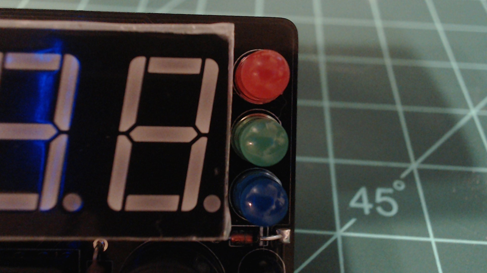

# LEDs

The Atlas kit has three LEDs on the right side of the device. If you soldered them on in the way that our guide specifies, then from top to bottom, they should be in the order: red, green, blue.

In code using the `Atlas` class you can reference each of these LEDs individually or you can reference them from an array.

- [Red LED](./red_led.md)
- [Green LED](./green_led.md)
- [Blue LED](./blue_led.md)
- [LED Array](./led_array.md)