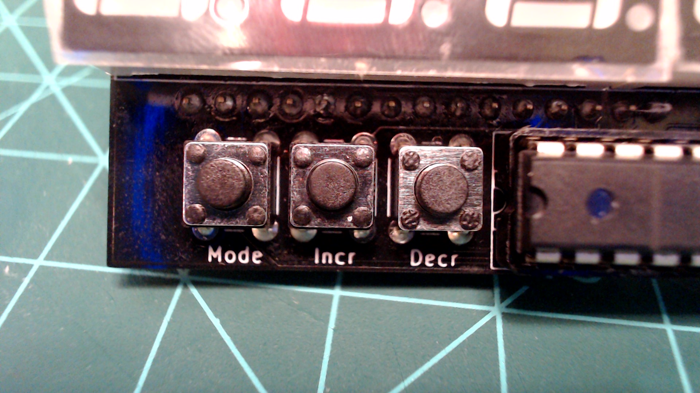

# Buttons

The Atlas kit has three buttons on the bottom left side of the device. These buttons are labeled from left to right: "Mode", "Incr", and "Decr".

The `Atlas` class has references to all three of these buttons. The `Atlas` class also has default callbacks that are already attached to the buttons.

- [Mode Button](./mode_button.md)
- [Incr Button](./incr_button.md)
- [Decr Button](./decr_button.md)