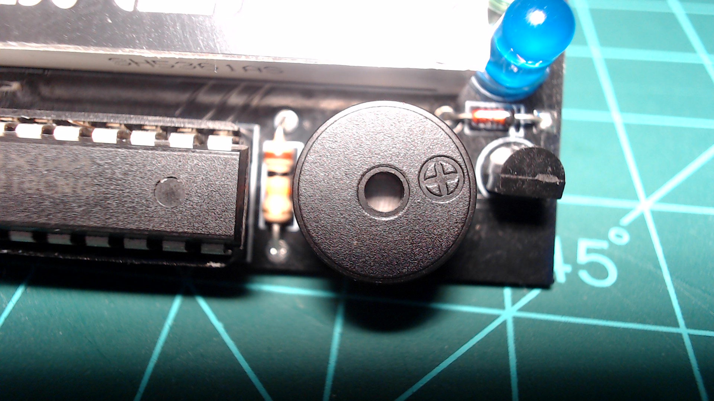

# Buzzer

The Atlas kit has one buzzer on the bottom right side of the device.



`atlas.py`

```python
from machine import Pin, SPI, Timer, RTC
import network
import time

...

_BUZZER = 0

...

class Atlas:
    def __init__(self):

        ...

        self.buzzer = Pin(_BUZZER, Pin.OUT)
        self.buzzer.value(1)
        self.note_timer = Timer(2)
        self.note_timer.deinit()

    ...

    def buzzer_callback(self, pin):
        self.toggle_pin(self.buzzer)

    def play_note(self, freq):
        self.note_timer.init(freq=freq, mode=Timer.PERIODIC, callback=self.buzzer_callback)
    
    def stop_note(self):
        self.note_timer.deinit()
        self.buzzer.value(1)

...
```

`sounds.py`

```python
NOTES = {
    'C3': 130.8,
    'CS3': 138.6,
    'DF3': 138.6,
    'D3': 146.8,
    'DS3': 155.6,
    'EF3': 155.6,
    'E3': 164.8,
    'F3': 174.6,
    'FS3': 185.0,
    'GF3': 185.0,
    'G3': 196.0,
    'GS3': 207.7,
    'AF3': 207.7,
    'A3': 220.0,
    'AS3': 233.1,
    'BF3': 233.1,
    'B3': 246.9,

    'C4': 261.6,
    'CS4': 277.2,
    'DF4': 277.2,
    'D4': 293.7,
    'DS4': 311.1,
    'EF4': 311.1,
    'E4': 329.6,
    'F4': 349.2,
    'FS4': 370.0,
    'GF4': 370.0,
    'G4': 392.0,
    'GS4': 415.3,
    'AF4': 415.3,
    'A4': 440.0,
    'AS4': 466.2,
    'BF4': 466.2,
    'B4': 493.9,

    'C5': 523.3,
    'CS5': 554.4,
    'DF5': 554.4,
    'D5': 587.3,
    'DS5': 622.3,
    'EF5': 622.3,
    'E5': 659.3,
    'F5': 698.5,
    'FS5': 740.0,
    'GF5': 740.0,
    'G5': 784.0,
    'GS5': 830.6,
    'AF5': 830.6,
    'A5': 880.0,
    'AS5': 932.3,
    'BF5': 932.3,
    'B5': 987.8,
}
```

## Usage

Pulse the buzzer at a specified frequency.

```python
Atlas.play_note(f)
```

`f` is a float value of the frequency you with to pulse the buzzer at.

Turn off the buzzer.

```python
Atlas.stop_note()
```

## Examples

```python
from atlas import Atlas
from time import sleep_ms

device = Atlas()

# play a note by specifying a frequency
device.play_note(440.0)
sleep_ms(5000)
device.stop_note()
```

```python
from atlas import Atlas
from sounds import NOTES
from time import sleep_ms

device = Atlas()

# specify a frequency using the the "NOTES" dictionary from sounds.py
device.play_note(NOTES["A4"])
sleep_ms(5000)
device.stop_note()
```
