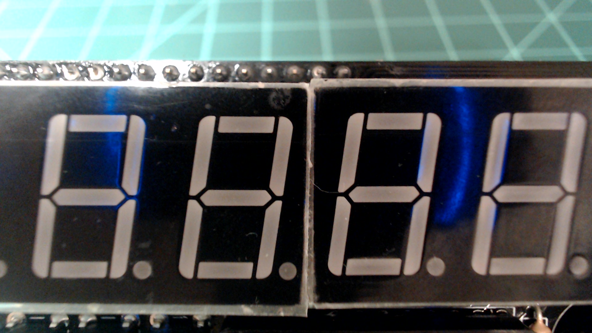
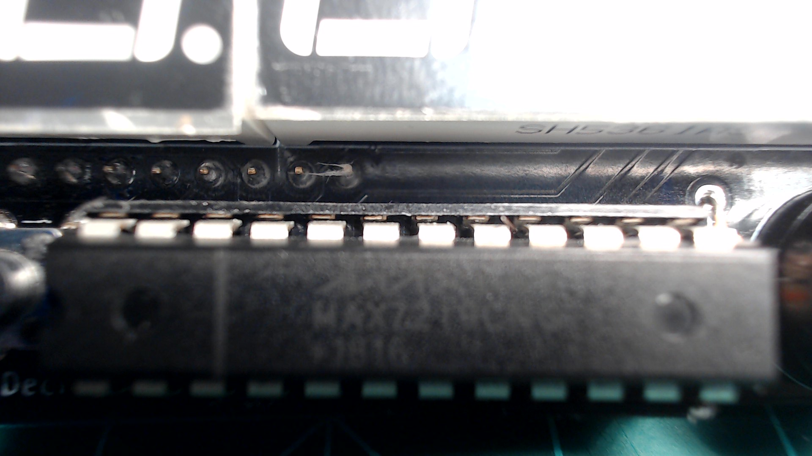

# Displays

The Atlas kit has two 3-digit 7-segment displays.



They are driven by a MAX7219 LED display driver which is located at in the center of the device at the bottom.



`atlas.py`

```python
from machine import Pin, SPI, Timer, RTC
import network
import time

...

_NOOP = 0x0
_DIGIT0 = 0x1
_DIGIT1 = 0x2
_DIGIT2 = 0x3
_DIGIT3 = 0x4
_DIGIT4 = 0x5
_DIGIT5 = 0x6
_DECODE_MODE = 0x9

_DIGIT_DICT = {
    0: _DIGIT0,
    1: _DIGIT1,
    2: _DIGIT2,
    3: _DIGIT3,
    4: _DIGIT4,
    5: _DIGIT5,
}

_DP = 0x80

...

_SPI_CS_PIN = 15

...

_MAX_VALUE_DEC = 999999
_MIN_VALUE_DEC = -99999

...

_MAX_VALUE_DP = 0b111111
_MIN_VALUE_DP = 0b000000

...

_DECODE_MODE = 9
_INTENSITY = 10
_SCAN_LIMIT = 11
_SHUTDOWN = 12
_DISPLAY_TEST = 15

...

class Atlas:
    def __init__(self):

        ...

        self._spi = SPI(1, baudrate=10000000, polarity=1, phase=0)
        self._cs = Pin(_SPI_CS_PIN)
        self._cs.init(self._cs.OUT, True)

        ...

        self._register(_SHUTDOWN, 0)
        self._register(_DISPLAY_TEST, 0)
        self._register(_SCAN_LIMIT, 7)
        self._register(_DECODE_MODE, 0)
        self._register(_SHUTDOWN, 1)
        self.display_clear()
        self.display_brightness(5)
        
    ...

    def display_brightness(self, value):
        if 0 <= value <= 15:
            self._register(_INTENSITY, value)
        else:
            raise ValueError("Brightness out of range")

    def display_clear(self):
        self._register(_DECODE_MODE, 0xFF)
        for i in range(6):
            self._register(_DIGIT_DICT[i], 0x0F)

        self.current_num = None

    def write_num(self, value, dp=0b000000):
        self._register(_DECODE_MODE, 0xFF)

        if (0 <= value <= _MAX_VALUE_DEC) and (_MIN_VALUE_DP <= dp <= _MAX_VALUE_DP):
            self.current_num = value
            self.current_dp = dp

            for i in range(6):
                current_value = value % 10

                if dp & 1:
                    self._register(_DIGIT_DICT[i], current_value | _DP)
                else:
                    self._register(_DIGIT_DICT[i], current_value)

                dp = dp >> 1
                value = value // 10

        elif (0 > value >= _MIN_VALUE_DEC) and (_MIN_VALUE_DP <= dp <= _MAX_VALUE_DP):
            self.current_num = value
            self.current_dp = dp

            value = -value
            self._register(_DIGIT5, 0xA)

            for i in range(5):
                current_value = value % 10

                if dp & 1:
                    self._register(_DIGIT_DICT[i], current_value | _DP)
                else:
                    self._register(_DIGIT_DICT[i], current_value)

                dp = dp >> 1
                value = value // 10

        else:
            raise ValueError("Value out of range")

    ...

    def increment_num(self):
        if self.current_num is None:
            raise ValueError("No value to increment")
        else:
            if (self.current_num + 1) > _MAX_VALUE_DEC:
                self.current_num = -1

            self.write_num(self.current_num + 1, self.current_dp)

    def decrement_num(self):
        if self.current_num is None:
            raise ValueError("No value to decrement")
        else:
            if (self.current_num - 1) < _MIN_VALUE_DEC:
                self.current_num = 1

            self.write_num(self.current_num - 1, self.current_dp)

    ...

    def _register(self, command, data):
        self._cs.value(0)
        self._spi.write(bytearray([command, data]))
        self._cs.value(1)

...
```

- [Display Settings](./display_settings.md)
- [Displaying Numbers](./displaying_numbers.md)